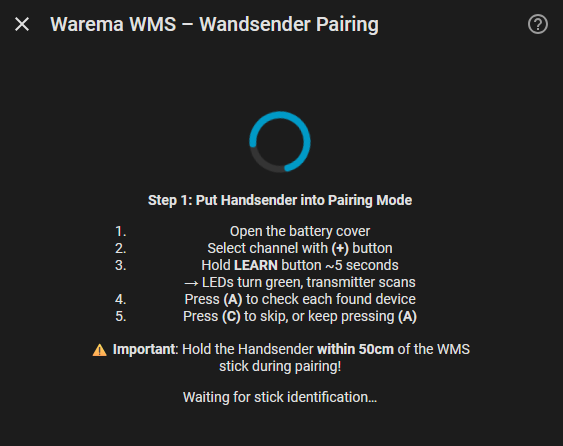
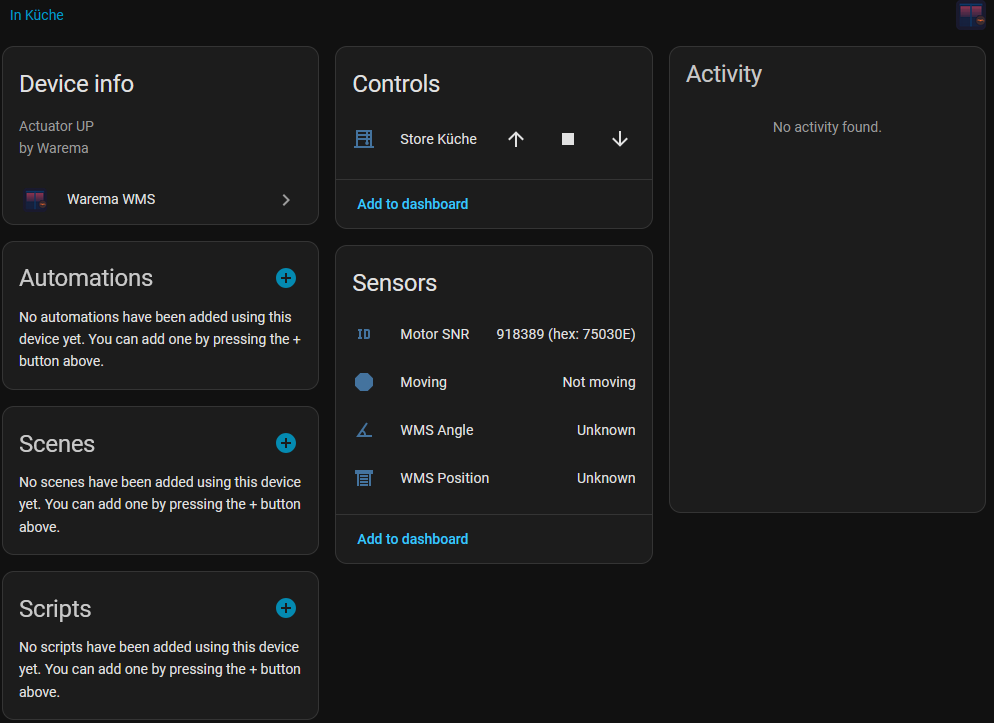

# Warema WMS Home Assistant Integration

[](https://github.com/hacs/integration)
[](https://github.com/mike-goldfinger/ha-warema-wms/releases)
[](LICENSE)
[](https://github.com/mike-goldfinger/ha-warema-wms)

<p align="center">
  <a href="https://github.com/mike-goldfinger/ha-warema-wms" target="_blank">
    Control your Warema WMS venetian blinds and shades through Home Assistant
  </a>
</p>

---

## ✨ Features

- 🪟 **Full blind control** — Open, close, stop, set position and tilt angle
- 📊 **Real-time monitoring** — Position, angle, and motion detection sensors
- 🔌 **USB auto-detection** — Plug in your Warema WMS Stick and go
- ⚙️ **Easy setup wizard** — Multiple discovery methods (manual, Wandsender pairing, new network)
- 🌍 **Multiple device support** — Works with Type 20, 21, 25, and 2E actuators
- 🎯 **Native Home Assistant integration** — Full cover entity support with all features
- 🐍 **Native Python integration** — Pure Python, no external bridge, add-on or MQTT broker required
- 🔐 **Local control only** — No cloud dependency, all communication is local

---

## 📷 Screenshots

**Configuration Flow — Wandsender Pairing**


**Device Control — Blind in Home Assistant**


---

## 🚀 Installation

### Via HACS — Custom Repository (current method)

Until this integration is accepted into the HACS default store, add it as a **custom repository**:

1. Open **HACS** in Home Assistant
2. Click the **⋮** menu (top right) → **Custom repositories**
3. Enter:
   - **Repository:** `https://github.com/mike-goldfinger/ha-warema-wms`
   - **Category:** `Integration`
4. Click **Add**
5. Search for **Warema WMS** in HACS and click **Download**
6. Restart Home Assistant
7. Add the integration via **Settings** → **Devices & Services** → **Add Integration**

### Via HACS — Default Store (once accepted)

Once the integration is part of the HACS default store:

1. Open **HACS** in Home Assistant
2. Go to **Integrations** and search for **Warema WMS**
3. Click **Download**
4. Restart Home Assistant
5. Add the integration via **Settings** → **Devices & Services** → **Add Integration**

### Manual Installation

1. Copy `custom_components/warema_wms/` to your HA `custom_components/` directory
2. Restart Home Assistant
3. Add the integration via **Settings** → **Devices & Services** → **Add Integration**

> **Note:** The `pywarema` library is bundled inside — no separate installation needed.

---

## ⚙️ Configuration

The integration uses a **configuration flow** with auto-detection and multiple setup options.

### Automatic Detection
Plug in your Warema WMS USB Stick (FTDI FT232R) and Home Assistant will notify you to start the setup wizard.

### Setup Wizard

**Step 1: Serial Port Selection**
- Auto-scans for connected USB sticks
- Or enter port path manually (e.g., `/dev/ttyUSB0`, `COM5`)

**Step 2: Network Discovery Method**

| Method | Use When | How It Works |
|--------|----------|-------------|
| **Enter manually** | You know your channel, PAN ID & key | Type in parameters directly |
| **Wandsender pairing** | You have an existing network | Wizard captures parameters from transmitter |
| **Create new network** | You want a fresh network | Wizard generates new credentials |

**Step 3: Select Devices**
- Auto-scans for blinds on the network
- Multi-select which ones to add

> **No network parameters needed upfront** — the wizard handles everything!

---

## 🎯 Supported Devices

| Type | Description |
|------|-------------|
| **20** | Actuator UP |
| **21** | Plug receiver |
| **25** | Radio motor |
| **2E** | Actuator 230V UP |

## 🏠 Hardware Requirements

- **Warema WMS USB Stick** (FTDI FT232R, USB VID: 0403, PID: 6001)
- **Supported blinds:** Type 20, 21, 25, or 2E actuators
- **Home Assistant:** 2023.1.0 or later
- **Python:** 3.9+

---

## 📊 Entities & Features

### Cover Entity
Each blind appears as a `cover` entity with:

| Control | Range | Notes |
|---------|-------|-------|
| **Position** | 0–100% | 0 = closed, 100 = open |
| **Tilt** | 0–100% | 0 = fully closed, 50 = horizontal, 100 = open |
| **Open** | — | Move to fully open |
| **Close** | — | Move to fully closed |
| **Stop** | — | Stop current movement |

### Sensor Entities
- **Motor SNR** — Serial number (6-digit hex)
- **WMS Position** — Raw position from device
- **WMS Angle** — Raw tilt angle from device

### Binary Sensor Entities
- **Moving** — `on` if blind is moving, `off` if stopped

> All entities are auto-discovered and named from the device's internal name.

---

## 🔄 Adding More Blinds Later

Go to the integration's **Configure** dialog to:
- Re-scan the network
- Add blinds that joined after initial setup
- Existing entities keep their history

---

## 💡 Position & Tilt Conventions

Home Assistant uses different conventions than WMS:

**Position**
- Home Assistant: 0 = closed, 100 = open
- WMS: 0 = open, 100 = closed
- → Automatically converted by the integration

**Tilt**
- Home Assistant: 0 = fully closed, 50 = horizontal, 100 = fully open
- WMS: −100 = fully closed, 0 = horizontal, +100 = fully open
- → Formula: `HA_tilt = (100 − WMS_angle) / 2`

---

## 🤝 Support & Contribution

### Issues & Bugs
Found a problem? Please report it on [GitHub Issues](https://github.com/mike-goldfinger/ha-warema-wms/issues) with:
- Error logs from Home Assistant
- Your hardware setup (device types, OS)
- Steps to reproduce

### Feature Requests
Have an idea? Share it on [GitHub Discussions](https://github.com/mike-goldfinger/ha-warema-wms/discussions)

### Want to Help?
Contributions are welcome! See `CONTRIBUTING.md` for:
- Development setup
- Code quality standards (Black, Pylint)
- Testing requirements
- Pull request guidelines

---

## 📚 Advanced: Protocol Details

The WMS protocol uses ASCII frames over serial at 125,000 baud:

```
{G}                          → Get stick name
{V}                          → Get stick version  
{K401<32-hex-key>}           → Set network key
{M%<channel><panid>}         → Switch channel/PAN
{R04FFFFFF7020<panid>02}     → Scan for devices
{R06<snr>801001000005}       → Get blind position
{R06<snr>707003<pos><ang>FFFF} → Move blind to position
{R06<snr>70700 1FFFFFFFFFF00}  → Stop blind
```

Responses use prefixes: `{r`, `{a}`, `{g`, `{v`, `{f}`

---

## 📜 License

This project is licensed under the **MIT License** — see `LICENSE` for details.

## 🙏 Credits

- **Protocol** reverse-engineered from the JavaScript [warema-wms-venetian-blinds](https://www.npmjs.com/package/warema-wms-venetian-blinds) package
- **Original research** by "Pman" and "willjoha" on the ioBroker forum
- **Home Assistant community** for the excellent integration framework

---

**Made with ❤️ for Home Assistant**

[](https://www.home-assistant.io/)
[](https://www.python.org/)
[](https://hacs.xyz/)
